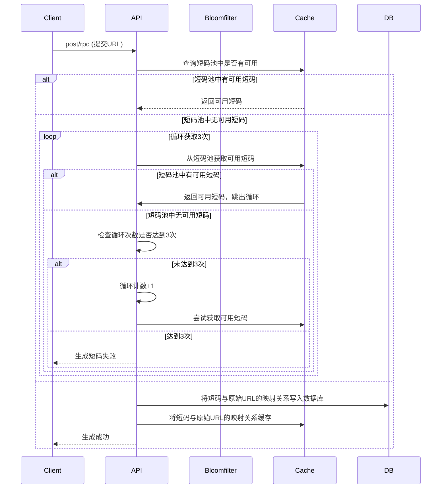
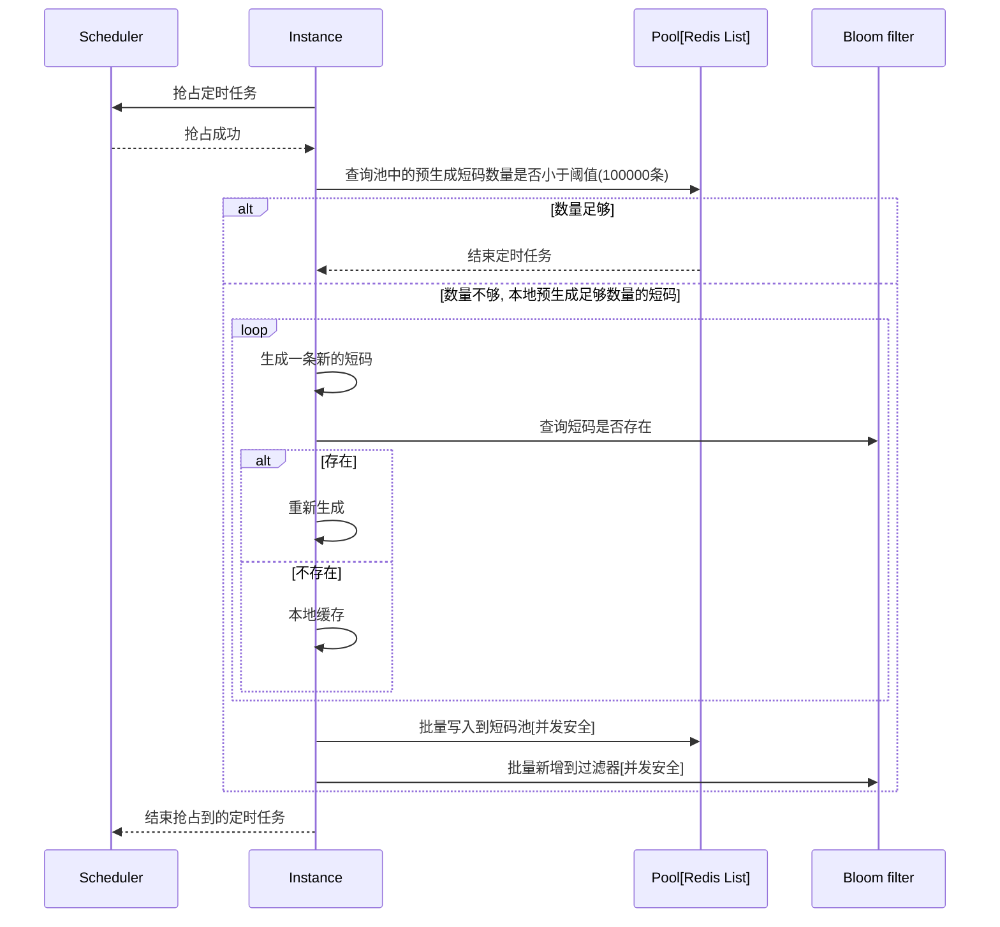

# shortlink-platform
基于Go实现的高可用、高性能短链接生成平台

### 1. 单条短码生成流程

```mermaid

sequenceDiagram
    participant Client
    participant API
    participant Bloomfilter
    participant Cache
    participant DB

    Client->>API: post/rpc (提交URL)
    API->>Cache: 查询短码池中是否有可用
    alt 短码池中有可用短码
        Cache-->>API: 返回可用短码
    else 短码池中无可用短码
        loop 循环获取3次
           API ->> Cache: 从短码池获取可用短码
           alt 短码池中有可用短码
               Cache->>API: 返回可用短码，跳出循环
           else 短码池中无可用短码
               API ->> API: 检查循环次数是否达到3次
               alt 未达到3次
                 API ->> API: 循环计数+1
                 API ->> Cache: 尝试获取可用短码
               else 达到3次
                 API -->> Client: 生成短码失败
               end
           end
        end
    else
      API->>DB: 将短码与原始URL的映射关系写入数据库
      API->>Cache: 将短码与原始URL的映射关系缓存
      API -->>Client: 生成成功
    end
```

### 2. 短码池预生成流程

```mermaid
sequenceDiagram
    participant Scheduler
    participant Instance
    participant Pool[Redis List]
    participant Bloom filter
    
    Instance ->> Scheduler: 抢占定时任务
    Scheduler -->> Instance: 抢占成功
    Instance ->> Pool[Redis List]: 查询池中的预生成短码数量是否小于阈值(100000条)
    alt 数量足够
        Pool[Redis List] -->> Instance: 结束定时任务
    else 数量不够, 本地预生成足够数量的短码
        loop
           Instance ->> Instance: 生成一条新的短码
           Instance ->> Bloom filter: 查询短码是否存在
           alt 存在
              Instance ->> Instance: 重新生成
           else 不存在
              Instance ->> Instance: 本地缓存
           end
        end
        Instance ->> Pool[Redis List]: 批量写入到短码池[并发安全]
        Instance ->> Bloom filter: 批量新增到过滤器[并发安全]
    end
    Instance -->> Scheduler: 结束抢占到的定时任务
```
