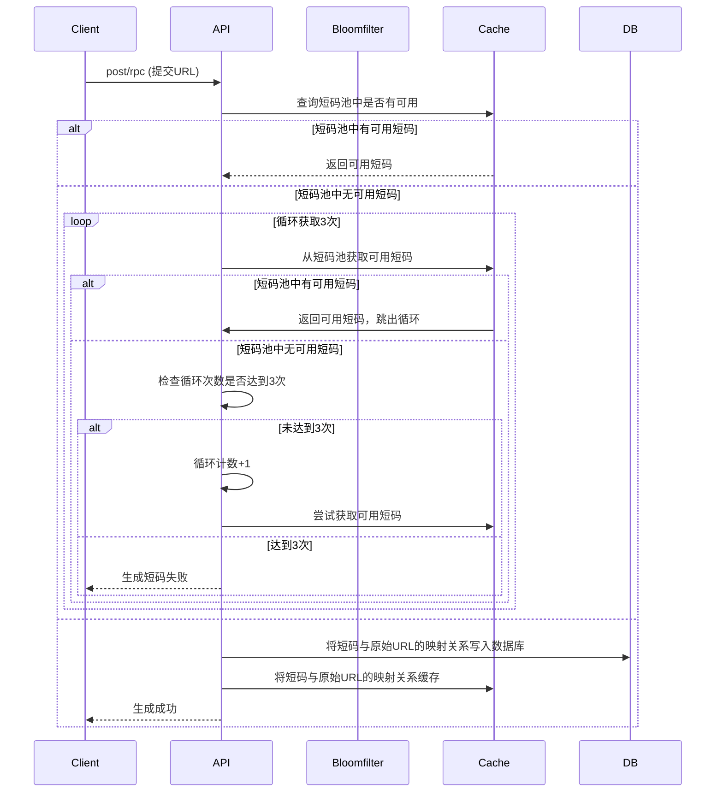

# shortlink-platform
基于Go实现的高可用、高性能短链接生成平台

### 单条短码生成流程

```mermaid

sequenceDiagram
    participant Client
    participant API
    participant Bloomfilter
    participant Cache
    participant DB

    Client->>API: post/rpc (提交URL)
    API->>Cache: 查询短码池中是否有可用
    alt 短码池中有可用短码
        Cache-->>API: 返回可用短码
    else 短码池中无可用短码
        loop 循环获取3次
           API ->> Cache: 从短码池获取可用短码
           alt 短码池中有可用短码
               Cache->>API: 返回可用短码，跳出循环
           else 短码池中无可用短码
               API ->> API: 检查循环次数是否达到3次
               alt 未达到3次
                 API ->> API: 循环计数+1
                 API ->> Cache: 尝试获取可用短码
               else 达到3次
                 API -->> Client: 生成短码失败
               end
           end
        end
    else
      API->>DB: 将短码与原始URL的映射关系写入数据库
      API->>Cache: 将短码与原始URL的映射关系缓存
      API -->>Client: 生成成功
    end
```
